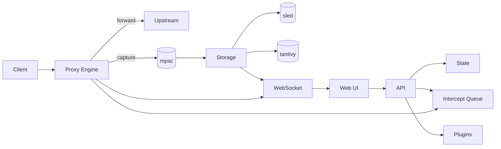

<p align="center">
  
</p>

<p align="center">
  <b>A Burp/ZAP-class interception proxy built from scratch in Rust.</b><br/>
  Async-first &middot; MITM TLS &middot; Full-text search &middot; Plugin-extensible
</p>

<p align="center">
  <a href="https://github.com/SpaceMoehre/roxy/actions"></a>
  <a href="LICENSE"></a>
  <a href="https://www.rust-lang.org"></a>
  <a href="https://hub.docker.com"></a>
</p>

---

## Why Roxy?

Most proxy tools are built on legacy stacks. **Roxy** is a ground-up Rust implementation using `tokio`, `hyper`, and `boring` (BoringSSL) — giving you a single-binary proxy with real async I/O, on-the-fly cert generation, and a modern web UI, all on one port.

---

## Features

| | |
|---|---|
| **Proxy & MITM** | HTTP/HTTPS interception with CONNECT tunneling, per-domain cert cache, and request/response mutation queues |
| **Web UI** | Target scope, Proxy (intercept + history), Intruder, Repeater, Decoder, Settings — all served from the proxy port |
| **Full-text Search** | Every captured exchange is indexed by `tantivy` for instant history search |
| **Intruder** | Async job execution with `sniper` and `cluster_bomb` strategies and live progress via WebSocket |
| **Plugins** | Python subprocess protocol with middleware hooks, dynamic UI injection, and state control |
| **ECH Support** | Encrypted Client Hello with automatic DNS HTTPS record resolution and GREASE fallback |
| **Single Port** | Proxy traffic, REST API, web UI, and WebSocket upgrades all on one listener |

---

## Quick Start

### From source

```bash
# Clone & run
git clone https://github.com/SpaceMoehre/roxy.git && cd roxy
cargo run -p roxy
```

Open **http://127.0.0.1:8080** — the web UI, API, and proxy all live here.

### Docker

```bash
docker compose up -d
```

### Docker (standalone)

```bash
docker build -t roxy .
docker run -p 8080:8080 roxy
```

---

## Architecture



### Crate Map

| Crate | Role |
|---|---|
| `roxy-core` | Proxy engine, MITM, certs, state, intruder logic |
| `roxy-tls` | TLS client/server, ECH support |
| `roxy-storage` | Exchange persistence + full-text search |
| `roxy-api` | REST API, embedded web assets, WebSocket server |
| `roxy-plugin` | Python plugin subprocess protocol |
| `roxy-app` | Composition binary & task orchestration |

### Tech Stack

| Layer | Implementation |
|---|---|
| Runtime | `tokio` |
| Proxy | `hyper` + `tokio-boring` |
| TLS/MITM | BoringSSL via `boring` — on-the-fly cert generation |
| API/Web | `ntex` |
| Realtime | `tokio-tungstenite` |
| Storage | `sled` (KV) + `tantivy` (full-text) |
| State | `DashMap` / lock-free atomics |

---

## Configuration

All configuration is via environment variables. Sensible defaults are provided.

| Variable | Default | Description |
|---|---|---|
| `ROXY_BIND` | `127.0.0.1:8080` | Listener address (proxy + API/UI + WS) |
| `ROXY_DATA_DIR` | `.roxy-data` | Cert store & data root |
| `ROXY_PLUGIN_DIR` | `./plugins` | Plugin autoload directory |
| `ROXY_DEBUG_LOGGING` | `false` | Verbose proxy debug logs |
| `ROXY_DEBUG_LOG_BODIES` | `false` | Include body previews in debug output |
| `ROXY_DEBUG_LOG_BODY_LIMIT` | `2048` | Max bytes per body preview |
| `ROXY_ECH_ENABLED` | `true` | Encrypted Client Hello |
| `ROXY_ECH_GREASE` | `true` | ECH GREASE when no config available |
| `ROXY_ECH_CONFIG_LIST_BASE64` | — | Optional base64 `ECHConfigList` override |

```bash
# Debug mode example
ROXY_DEBUG_LOGGING=true RUST_LOG=debug cargo run -p roxy -- --debug
```

---

<details>
<summary><strong>API Reference</strong></summary>

Base path: `/api/v1`

#### Health

| Method | Endpoint | Description |
|---|---|---|
| `GET` | `/health` | Health check |
| `GET` | `/ws/stats` | WebSocket stats stream |

#### Proxy Controls

| Method | Endpoint | Description |
|---|---|---|
| `GET\|PUT` | `/proxy/intercept` | Request interception toggle |
| `GET\|PUT` | `/proxy/intercept-response` | Response interception toggle |
| `GET\|PUT` | `/proxy/mitm` | MITM toggle |
| `GET` | `/proxy/intercepts` | Pending request intercepts |
| `POST` | `/proxy/intercepts/{id}/continue` | Continue/mutate intercepted request |
| `GET` | `/proxy/response-intercepts` | Pending response intercepts |
| `POST` | `/proxy/response-intercepts/{id}/continue` | Continue/mutate intercepted response |
| `GET` | `/proxy/settings/ca.der` | Download CA certificate |
| `POST` | `/proxy/settings/ca/regenerate` | Regenerate CA |

#### Target & History

| Method | Endpoint | Description |
|---|---|---|
| `GET` | `/target/site-map` | Site map tree |
| `GET\|PUT\|POST` | `/target/scope` | Scope rules |
| `DELETE` | `/target/scope/{host}` | Remove host from scope |
| `GET` | `/history/search` | Full-text search |
| `GET` | `/history/recent` | Recent exchanges |

#### Repeater / Decoder / Intruder

| Method | Endpoint | Description |
|---|---|---|
| `POST` | `/repeater/send` | Send crafted request |
| `POST` | `/decoder/transform` | Encode/decode transform |
| `POST\|GET` | `/intruder/jobs` | Create or list jobs |
| `GET\|DELETE` | `/intruder/jobs/{id}` | Get or cancel job |
| `GET` | `/intruder/jobs/{id}/results` | Job results |

#### Plugins

| Method | Endpoint | Description |
|---|---|---|
| `GET\|POST` | `/plugins` | List or register plugins |
| `DELETE` | `/plugins/{id}` | Remove plugin |
| `GET\|PUT` | `/plugins/{id}/settings` | Plugin settings |
| `GET` | `/plugins/{id}/alterations` | Alteration history |
| `POST` | `/plugins/{id}/invoke` | Invoke plugin |
| `GET\|POST` | `/ui/modules` | Dynamic UI modules |

</details>

---

## Plugins

Roxy supports Python plugins that hook into the proxy pipeline.

```bash
# Install the SDK
pip install ./python/roxy-plugin-sdk
```

**Middleware hooks:** `on_request_pre_capture` · `on_response_pre_capture`

Plugins can:
- Mutate requests and responses in-flight
- Toggle runtime flags (intercept, MITM, scope) via `state_ops`
- Inject custom UI tabs and settings panels via `register_ui_modules`
- Extend the Decoder with custom transforms (`plugin:<name>`)

Bundled plugins live in `plugins/` and are auto-loaded at startup.

---

## Testing

```bash
# Unit + integration tests
cargo test --all

# End-to-end tests (requires network)
cargo test -p roxy -- --ignored --nocapture
```

E2E coverage includes API smoke tests, proxy intercept round-trips, HTTPS capture validation, and plugin middleware flows.

---

## CI/CD

GitHub Actions workflow at `.github/workflows/ci-release.yml`:

- **Push / PR** — format check + full test suite
- **Tag push / Release** — builds release binary, uploads GitHub Release assets, pushes Docker image to Docker Hub

---

## Roadmap

- [x] Full async proxy pipeline with interception, storage, and web/API control
- [ ] Advanced intruder payload templating & marking workflows
- [ ] Auth / RBAC and multi-tenant API controls

---

## License

[GPL-3.0](LICENSE)
