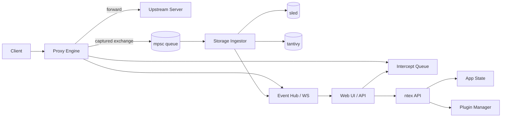

# roxy

High-performance, async-first HTTP(S) interception proxy for security testing workflows.

`roxy` (rust-proxy) is a Burp/ZAP-style foundation built in Rust with non-blocking I/O, MITM interception, live API control, and searchable traffic history.

## Overview

| Area | Implementation |
|---|---|
| Runtime | `tokio` |
| Proxy Core | `hyper` + `reqwest` |
| HTTPS MITM | `tokio-rustls` + on-the-fly cert generation |
| Web/API Server | `ntex` |
| Realtime Events | `tokio-tungstenite` |
| Persistence | `sled` (raw exchange store) + `tantivy` (full-text search) |
| Shared State | `DashMap` / lock-free atomics where appropriate |
| Plugin Runtime | Python subprocess protocol (`roxy-plugin`) |

## Key Features

- HTTP and HTTPS proxying with CONNECT support.
- MITM TLS interception with generated CA + per-domain cert cache.
- Request and response interception queues with continue/drop/mutate controls.
- Queue draining behavior when request interception is disabled.
- Port auto-increment on bind conflicts for proxy, API, and WS listeners.
- Web UI served from `/` with sections:
  - Target
  - Proxy (Intercept + History subtabs)
  - Intruder
  - Repeater
  - Decoder
  - Events
  - Settings
- Proxy history UX:
  - upper list of captured requests
  - lower split viewer for selected item
  - mode toggles: request / response / both
- Intruder with async job execution, strategies (`cluster_bomb`, `sniper`), and live progress.
- Repeater and Decoder exposed as API operations.
- Plugin state operations (toggle intercept/MITM/scope from plugin outputs).

## Architecture



## Workspace Layout

| Crate | Responsibility |
|---|---|
| `crates/roxy-core` | Proxy engine, MITM, certs, state, intruder core logic |
| `crates/roxy-storage` | Exchange persistence + history search/list |
| `crates/roxy-api` | HTTP API + embedded web assets + WS server |
| `crates/roxy-plugin` | Python plugin process interface |
| `crates/roxy-app` | Composition binary and task orchestration |

## Quick Start

### Prerequisites

- Rust stable toolchain
- `cargo`

### Run

```bash
ROXY_PROXY_BIND=127.0.0.1:8080 \
ROXY_API_BIND=127.0.0.1:3000 \
ROXY_WS_BIND=127.0.0.1:3001 \
ROXY_DATA_DIR=.roxy-data \
cargo run -p roxy
```

Debug startup with CLI flag:

```bash
cargo run -p roxy -- --debug
```

Open:

- Web UI: `http://127.0.0.1:3000/`
- API base: `http://127.0.0.1:3000/api/v1`

Notes:

- If a bind address is already in use, roxy increments port(s) until an available one is found.
- The web client auto-detects WS default URL using the actual runtime WS port via `/api/v1/ws/stats`.

## Runtime Configuration

| Env Var | Default | Description |
|---|---|---|
| `ROXY_PROXY_BIND` | `127.0.0.1:8080` | Proxy listener |
| `ROXY_API_BIND` | `127.0.0.1:3000` | API/UI listener |
| `ROXY_WS_BIND` | `127.0.0.1:3001` | WebSocket listener |
| `ROXY_DATA_DIR` | `.roxy-data` | Cert and storage root |
| `ROXY_DEBUG_LOGGING` | `false` | Enables extensive proxy debug logs |
| `ROXY_DEBUG_LOG_BODIES` | `false` | Includes request/response body previews in debug logs |
| `ROXY_DEBUG_LOG_BODY_LIMIT` | `2048` | Max bytes logged per body preview |

Debugging example:

```bash
ROXY_DEBUG_LOGGING=true \
ROXY_DEBUG_LOG_BODIES=true \
ROXY_DEBUG_LOG_BODY_LIMIT=8192 \
RUST_LOG=debug \
cargo run -p roxy
```

## API Summary

Base: `/api/v1`

### Health / WS

- `GET /health`
- `GET /ws/stats`

### Proxy Controls

- `GET|PUT /proxy/intercept`
- `GET|PUT /proxy/intercept-response`
- `GET|PUT /proxy/mitm`
- `GET /proxy/intercepts`
- `POST /proxy/intercepts/{id}/continue`
- `GET /proxy/response-intercepts`
- `POST /proxy/response-intercepts/{id}/continue`
- `GET /proxy/settings/ca.der`
- `POST /proxy/settings/ca/regenerate`

### Target / History

- `GET /target/site-map`
- `GET|PUT|POST /target/scope`
- `DELETE /target/scope/{host}`
- `GET /history/search`
- `GET /history/recent`

### Repeater / Decoder / Intruder

- `POST /repeater/send`
- `POST /decoder/transform`
- `POST|GET /intruder/jobs`
- `GET|DELETE /intruder/jobs/{id}`
- `GET /intruder/jobs/{id}/results`

### Plugins

- `GET|POST /plugins`
- `DELETE /plugins/{id}`
- `POST /plugins/{id}/invoke`

## Testing

### Standard test suite

```bash
cargo test --all
```

### Integration tests that require real sockets/network

Ignored tests are provided for true runtime scenarios (process startup, live proxying, history verification):

```bash
cargo test -p roxy-app -- --ignored --nocapture
```

Included:

- script-based API smoke test
- proxy intercept + history end-to-end
- HTTPS `ifconfig.co` via proxy + capture validation

## Plugin Notes

- Plugins are external Python scripts managed by the plugin manager.
- Decoder extension mode format: `plugin:<plugin-name>`.
- Plugin output can include `state_ops` to mutate runtime controls (e.g. intercept flags, MITM, scope hosts).

## Current Status and Roadmap

Implemented now:

- Full async proxy pipeline with interception, storage, and web/API control.

Planned next milestones:

- Optional `boring`-based upstream TLS path behind feature flags.
- More advanced intruder payload templating/marking workflows.
- Expanded auth/RBAC and multi-tenant API controls.

## License

[MIT](LICENSE)
